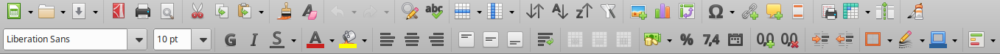
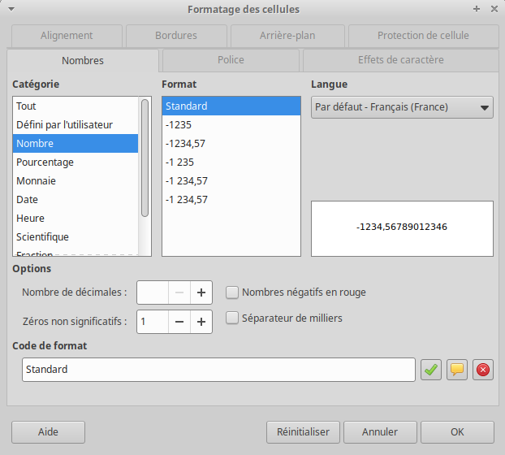

<!DOCTYPE html>
<html>
    <head>
        <title>CM (BDR1)</title>
        <link rel="stylesheet" href="./index.css">
        
    </head>
    <body>
        
        <header></header>
        <main>

# CM2 : Mise en forme

## Barre d'outils

La **barre d'outils** intègre de nombreux raccourcis permettant d'éditer la feuille de calcul sans passer par les menus :

    

💡 Survoler une icône de la barre d'outil affiche une courte description, ainsi qu'éventuellement un raccourcit clavier. Retenir les raccourcit claviers de fonctionnalités fréquemment utilisés permet à terme d'augmenter sa productivité.

💡 La barre d'outils est personnalisable via le menu "Affichage => Barre d'outils".

### Mise en forme du contenu

Comme dans les logiciels de traitement de texte, il est possible de mettre en forme le contenu d'une cellule, i.e. de modifier sa police d'écriture, la taille de la police, mettre en gras, en italique, souligner, changer la couleur du texte, changer la couleur du fond :

    <calc-sheet id="sheet_format_content" cols=6 rows=2></calc-sheet>
    <calc-toolbar id='sheet_toolbar_format_content'></calc-toolbar>

### Alignement du contenu

Il est aussi possible d'aligner le contenu d'une cellule horizontalement et verticalement :

    

+ Ajuster quand ça dépasse (non implémenté ici)

### Format du contenu

Il est aussi possible de modifier le format des nombres affichés en les affichant comme une monnaie, un pourcentage, une date, en ajoutant ou retirant des décimales :

    

    

💡 De nombreux autres formats sont disponibles dans le menu "Format => Cellules... => Nombres" :

    

### Bordures

Il est aussi possible de fixer les bordures des cellules, leur style, ainsi que leur couleur :

    

💡 Vous pouvez définir l'épaisseur de la bordure dans le menu "Format => Cellules... => Bordures" :

    

### Retraits

Les retraits permettent de décaler le contenu des cellules :

    

    

## Plages

-> [motivation] sélection plage (ctrl+super+ligne/col)
    => e.g. pour formatter plusieurs cellules en même temps.

### Fusionner et scinder des cellules

Il est aussi possible de fusionner des cellules pour n'en faire qu'une. Les cellules fusionnées peuvent être scindées.

    

    

## Format

-> copier/supprimer le format // collage spécial (sans format)
-> définir un format
        -> format définis / styles ?

## Insertions

Il est aussi possible d'insérer des images, des diagrammes (cf suite cours), des tables dynamiques (cf suites cours), des caractères spéciaux, des liens hypertextes ainsi que des commentaires :

    

### Commentaires

Un commentaire apparaît comme un carré rouge en haut à droite d'une cellule. Au survol de la cellule, le commentaire apparaît :

    
    

    <video loop autoplay>
        <source src="./videos/commentaire.webm" type="video/webm">
    </video>

<!-- 1361x200 -->

## Lignes et colonnes

### Redimensionner les lignes et colonnes

Il est possible de redimensionner une ligne (ou colonne) en plaçant le curseur entre deux lignes (ou colonnes). Double-cliquer redimensionnera la ligne (ou colonne) de manière optimale quand clicker et déplacer vous permet de choisir la dimension désirée :

    
    

<!-- 320x200 -->

 <video loop autoplay>
  <source src="./videos/redimensionner-opti.webm" type="video/webm">
</video>
 <video loop autoplay>
  <source src="./videos/redimensionner.webm" type="video/webm">
</video>

### Cacher les lignes/colonnes

Certaines lignes (ou colonnes) peuvent être moins importantes que d'autres, e.g. :
- détails
- calculs intermédiaires
- données initiales

Pour garder la feuille de calcul lisible, on peut masquer les lignes (ou colonnes) sélectionnées grâce à F12 (Ctrl+F12 pour dégrouper) :

    
    

    <video loop autoplay>
        <source src="./videos/grouper.webm" type="video/webm">
    </video>

### Ajouter/Supprimer

déplacer sélections vs ajouter/supprimer

# TP

 [cf TP6+2+1] Plages
# NEXT

-> opérateurs de plage lors des plages

# CM1:

x
- maj+ctrl+maj+V (CM2) + ctrl+M copier formattage
+ astuce ctrl+X
- commentaires + liens (cf links)

</main>
    </body>
</html>