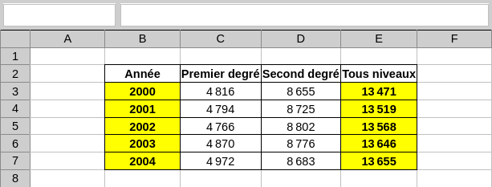

<!DOCTYPE html>
<html>
    <head>
        <title>TP1 (Tableur)</title>
        <link rel="stylesheet" href="./index.css">
        
    </head>
    <body>
        <header></header>
        <main>

# TP1 : ?

*💡 Ce TP est inspiré de sources en partie inconnues.*

## Consignes

<tp-consignes></tp-consignes>

## ?

<todo>Rewrite</todo>

Sur Moodle, vous trouverez le fichier "TP1.ods". Téléchargez-le, puis ouvrez-le dans Libre Office Calc.

À chaque feuille correspond un exercice. Vous devrez :
- écrire des formules dans les cellules jaunes, que vous renseignerez aussi sur ce sujet.
- compléter les cellules oranges via la poignée de recopie.

À la fin du TP, vous exporterez vos réponses et les déposerez sur Moodle avec votre fichier de tableur.

## Exercices

### Exercice 1

Modifiez la feuille de calcul afin d'obtenir le tableau suivant :

    

💡 Vous penserez à utiliser la **poignée de recopie**.

<strong><em>Votre réponse :</em></strong>

    <tp-sheet sheet="Exo 1"></tp-sheet>

- <tp-cell_from_sheet sheet="Exo 1" cell="B3"></tp-cell_from_sheet>
- <tp-cell_from_sheet sheet="Exo 1" cell="E3"></tp-cell_from_sheet>

### Exercice 2

Modifiez la feuille de calcul afin d'obtenir le tableau suivant :

💡 Vous noterez que la différence entre deux dates est classiquement exprimée en jours.

<strong><em>Votre réponse :</em></strong>

    <tp-sheet sheet="Exo 2"></tp-sheet>

- <tp-cell_from_sheet sheet="Exo 2" cell="D4"></tp-cell_from_sheet>
- <tp-cell_from_sheet sheet="Exo 2" cell="D9"></tp-cell_from_sheet>

### Exercice 3

Le prix TTC (toutes taxes comprises) est calculé à partir du prix HT (hors taxes) auquel on ajoute le montant de la TVA (un certain pourcentage du prix HT).

<strong><em>Votre réponse :</em></strong>

    <tp-sheet sheet="Exo 3"></tp-sheet>

- <tp-cell_from_sheet sheet="Exo 3" cell="D5"></tp-cell_from_sheet>
- <tp-cell_from_sheet sheet="Exo 3" cell="E5"></tp-cell_from_sheet>

### Exercice 4

Dans cet exercice, vous devez produite une table de multiplication.

<strong><em>Votre réponse :</em></strong>

    <tp-sheet sheet="Exo 4"></tp-sheet>

- <tp-cell_from_sheet sheet="Exo 4" cell="C3"></tp-cell_from_sheet>

## Rendu

<tp-file_input default="../../../../assets/tableur/sujets/TP1.ods"></tp-file_input>

</main>
    </body>
</html>