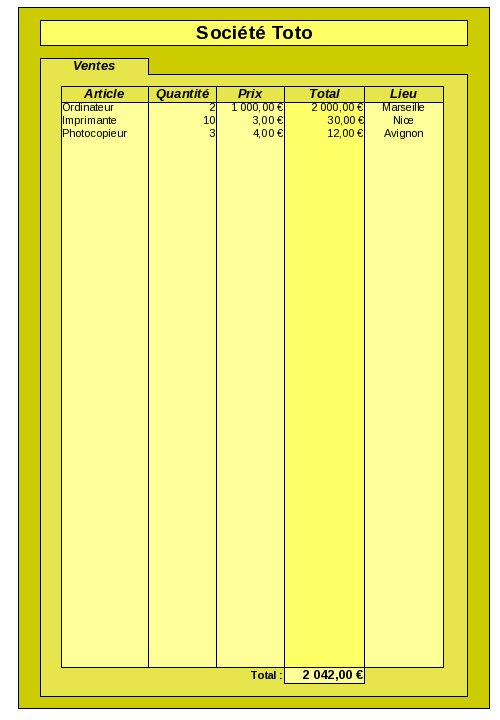

<!DOCTYPE html>
<html>
    <head>
        <title>TP2 (Tableur)</title>
        <link rel="stylesheet" href="./index.css">
        
    </head>
    <body>
        <header></header>
        <main>

# TP2 : Mise en forme

*💡 Ce TP est inspiré de sources en partie inconnues.*

## Consignes

<tp-consignes></tp-consignes>

### Consignes tableur

Vous créerez un nouveau fichier tableur possédant une unique feuille nommée `Facture`.

À la fin du TP vous importerez le fichier dans le sujet de TP.

## Exercices

### Exercice 1

Modifiez la feuille de calcul afin d'obtenir le tableau suivant :

    

<strong><em>Votre réponse :</em></strong>

    <tp-sheet sheet="Facture"></tp-sheet>

## Rendu

<tp-file_input default="../../../../assets/tableur/sujets/TP2.ods"></tp-file_input>

</main>
    </body>
</html>